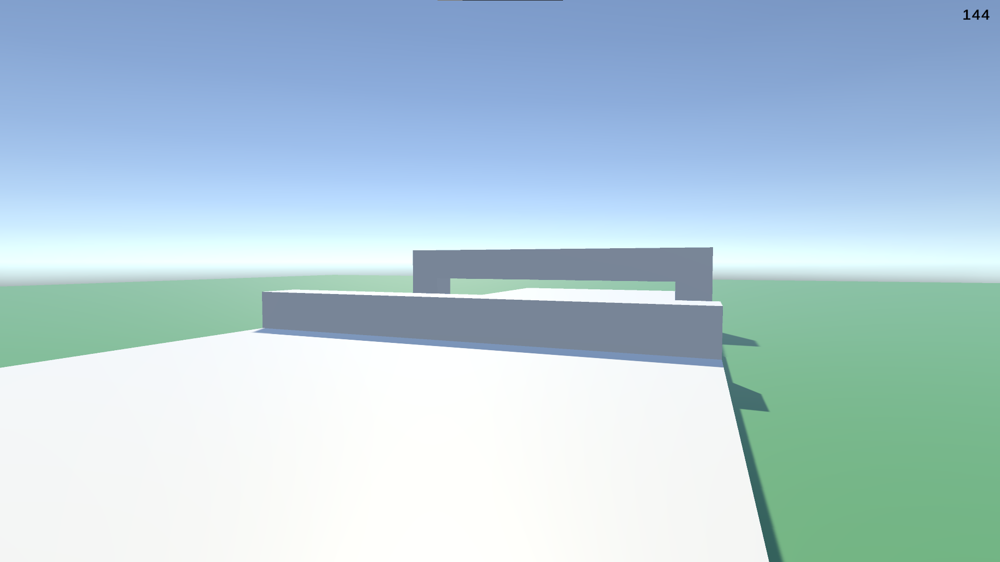

# Unity Walking, Running, Jumping, and Crouching Game

This project demonstrates basic character movement mechanics in Unity. It includes functionality for walking, running, jumping, and crouching, allowing the player to control a character in a simple 3D environment.

## Features

- **Walking**: Move the character at a normal pace.
- **Running**: Sprint by holding the run button.
- **Jumping**: Jump to reach higher platforms or avoid obstacles.
- **Crouching**: Crouch to pass through low spaces or hide.

## Controls

- **W, A, S, D**: Move the character (forward, left, backward, right).
- **Shift**: Hold to run.
- **Spacebar**: Jump.
- **Ctrl**: Crouch.

## How to Play

1. Download the repository.
2. Unpack the files.
3. Build and run the game by executing `survival.exe`.

## Requirements

- A PC running Windows, Mac or Linux.

## Preview

Here’s a preview of the game in action:

